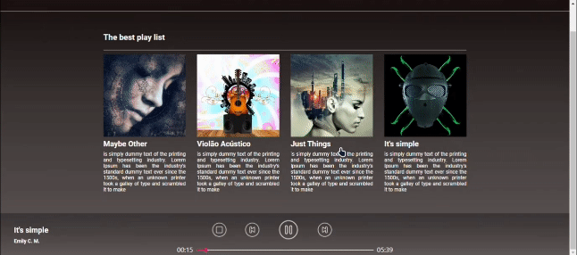

# Music Player com React :computer:

Este projeto consiste num music player realizado para fim de avaliação das habilidades em Front-End dos alunos em React pelo curso de Desenvolvimento de Software que realizei pela Cubos Academy. Nele haverá uma lista com as musicas disponíveis assim como seus títulos, capa e descrição. Além de conter uma barra de funções com botões para pausar, parar, dar play e navegar entre as músicas.

## Como abrir? :gear:

Depois que você der um `Fork` no repositório e `Clonar` para o seu dispositivo, é só abrir o console para e primeiro utilizar o comando `npm install` para instalar todas as dependências do projeto e depois usar o `npm run dev` para rodar a aplicação e poder abrí-la em seu navegador.

## Contribuição :handshake:

Você pode contribuir com este repositório utilizando [Gitflow Workflow](https://www.atlassian.com/git/tutorials/comparing-workflows/gitflow-workflow) e [Conventional Commits](https://www.conventionalcommits.org/en/v1.0.0/), seguindo os seguintes passos:

- Crie uma `branch` da branch principal;
- Faça suas contribuições;
- Abra uma [Pull Request](https://docs.github.com/en/pull-requests/collaborating-with-pull-requests/proposing-changes-to-your-work-with-pull-requests/creating-a-pull-request) para a branch principal;
- Aguarde pela análise e futura aprovação.

Eu ficarei muito agradecido por sua contribuição :crossed_fingers:

## Status

Finalizado :heavy_check_mark:
